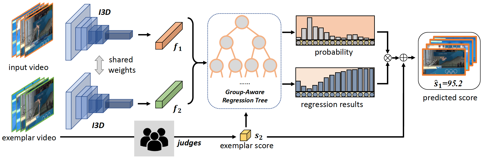
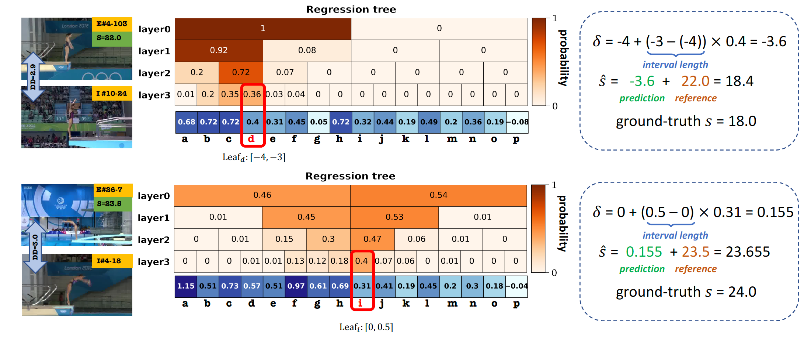

CoRe
===

[](https://paperswithcode.com/sota/action-quality-assessment-on-aqa-7?p=group-aware-contrastive-regression-for-action)[](https://paperswithcode.com/sota/action-quality-assessment-on-mtl-aqa?p=group-aware-contrastive-regression-for-action)


Created by [Xumin Yu\*](https://yuxumin.github.io/), [Yongming Rao\*](https://raoyongming.github.io/), [Wenliang Zhao](https://wl-zhao.github.io/), [Jiwen Lu](https://scholar.google.com/citations?user=TN8uDQoAAAAJ&hl=en&authuser=1), [Jie Zhou](https://scholar.google.com/citations?user=6a79aPwAAAAJ&hl=en&authuser=1)

This is the PyTorch implementation for ICCV paper __Group-aware Contrastive Regression for Action Quality Assessment__ [arXiv](https://arxiv.org/abs/2108.07797).

We present a new Contrastive Regression (*__CoRe__*) framework to learn the relative scores by pair-wise comparison, which highlights the differences between videos and guides the models to learn the key hints for action quality assessment.




## Pretrained Model
- Our pretrained CoRe model for MTL-AQA is available at [[Tsinghua Cloud]](https://cloud.tsinghua.edu.cn/f/2dc6e1febc0e49fdb711/?dl=1) [[Google Drive]](https://drive.google.com/file/d/13e5FmVESs77J4__AMphEz_twB-XZHZ5E/view?usp=sharing)

## Usage

### Requirement
- Python >= 3.6
- Pytorch >= 1.4.0
- torchvision >= 0.4.1
- torch_videovision
```
pip install git+https://github.com/hassony2/torch_videovision
```


### Download initial I3D 
We use the Kinetics pretrained I3D model from the reposity [kinetics_i3d_pytorch](https://github.com/hassony2/kinetics_i3d_pytorch/blob/master/model/model_rgb.pth)

### Dataset Preparation

#### MTL-AQA
- Please download the dataset from the repository [MTL-AQA](https://github.com/ParitoshParmar/MTL-AQA).
The data structure should be:
```
$DATASET_ROOT
├── MTL-AQA/
    ├── new
        ├── new_total_frames_256s
            ├── 01
            ...
            └── 09
    ├── info
        ├── final_annotations_dict_with_dive_number
        ├── test_split_0.pkl
        └── train_split_0.pkl
    └── model_rgb.pth
```

The processed annotations are already provided in this repo. You can download the prepared dataset [[BaiduYun]](https://pan.baidu.com/s/1ZUHyvYFia0cJtPp7pTfAbg)(code:smff). Download and unzip the four zip files under MTL-AQA/, then follow the structure. If you want to prepare the data by yourself, please see [MTL_helper](./DATASET.md) for some helps. We provide codes for processing the data from an online video to the frames data.

#### AQA-7
- Download AQA-7 Dataset:
```
mkdir AQA-Seven & cd AQA-Seven
wget http://rtis.oit.unlv.edu/datasets/AQA-7.zip
unzip AQA-7.zip
```

The data structure should be:
```
$DATASET_ROOT
├── Seven/
    ├── diving-out
        ├── 001
            ├── img_00001.jpg
            ...
        ...
        └── 370
    ├── gym_vault-out
        ├── 001
            ├── img_00001.jpg
            ...
    ...

    └── Split_4
        ├── split_4_test_list.mat
        └── split_4_train_list.mat
```
You can download he prepared dataset [[BaiduYun]](https://pan.baidu.com/s/1mcXo6g1XXhm9f0qL5lsNNw)(code:65rl). Unzip the file under Seven/

#### JIGSAWS
- Please download the dataset from [JIASAWS](https://cs.jhu.edu/~los/jigsaws/info.php). You are required to complete a form before you use this dataset for __academic research__.

The training and test code for JIGSAWS is on the way.


### Training and Evaluation
To train a CoRe model:
```
bash ./scripts/train.sh <GPUIDS>  <MTL/Seven> <exp_name>  [--resume] 
```

For example,
```
# train a model on MTL
bash ./scripts/train.sh 0,1 MTL try 

# train a model on Seven
bash ./scripts/train.sh 0,1 Seven try --Seven_cls 1
```

To evaluate a pretrained model:
```
bash ./scripts/test.sh <GPUIDS>  <MTL/Seven> <exp_name>  --ckpts <path> [--Seven_cls <int>]
```
For example,
```
# test a model on MTL
bash ./scripts/test.sh 0 MTL try --ckpts ./MTL_CoRe.pth

# test a model on Seven
bash ./scripts/test.sh 0 Seven try --Seven_cls 1 --ckpts ./Seven_CoRe_1.pth
```


### Visualizatin Results


## Citation
If you find our work useful in your research, please consider citing:
```
@misc{yu2021groupaware,
      title={Group-aware Contrastive Regression for Action Quality Assessment}, 
      author={Xumin Yu and Yongming Rao and Wenliang Zhao and Jiwen Lu and Jie Zhou},
      year={2021},
      eprint={2108.07797},
      archivePrefix={arXiv},
      primaryClass={cs.CV}
}
```
